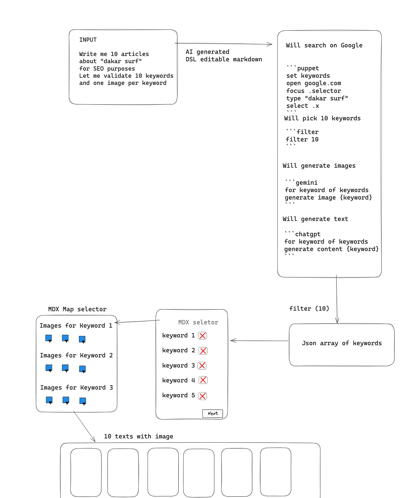

# 🧩 NoClick

Think of **NoClick** n8n. Connect ideas with text, not clicks.

**NoClick** is a modular, plugin-driven **AI automation system** built 
a list of tools that are AI such as Langchain , or not AI **Puppeteer**.

The input of the toolchain is usually a markdown, the output depends on the purpose.

It is the core of a larger vision for **AI-driven workflows** such as SEO page generation, web scraping, content
enrichment, and more.



---

## 🚀 Features

- **Shared Execution Context**: Structured data and metadata tracking across all actions.
- **Flexible Plugin System**: Extend value extraction with custom plugins (attributes, regex, transformations, etc.).
- **Modular Actions**: Each interaction is cleanly separated into Action classes (`SetAction`, `ClickAction`,
  etc.).
- **Declarative DSL**: AI will process your markdown into modifiable DSL. DSL will use and manipulate SharedExecutionContext and execute actions. 
- **Future-proof**: Designed to integrate with LLM agents, MPCs and broader AI workflows.

---

## ✨ Example Script

```puppet
open https://www.example.com
setkey data.user.name
set .name@attr[value]

setkey data.prices
setAll div.price@textContent

setkey data.catalog
setMap .product .title@textContent .price@attr[data-price]
```

---

## 📦 Project Structure

```plaintext
packages/
  imagine/
    src/
      puppets/
        base-action.ts
        set-action.ts
        ...
      plugins/
        text-content-plugin.ts
        attribute-plugin.ts
        ...
      plugin-store.ts
      browser/
        browser-manager.ts
      types/
        actions.ts
        context.ts
```

- **Puppets**: Action classes like `SetAction`, `ClickAction`, etc.
- **Plugins**: Value extractors like `attr`, `textContent`, `regex`, etc.
- **Plugin Store**: Central registry to manage plugins dynamically.
- **Browser Manager**: Handles Puppeteer lifecycle (open/close).
- **Types**: Shared types for actions, plugins, and context.

---

## 🛠 How It Works

1. **Parse** the script into actions.
2. **Execute** each action using Puppeteer.
3. **Extract** data through ValuePicker plugins.
4. **Mutate** the `ExecutionContext` (structured data + meta logs).
5. **Continue** into other tools (e.g., AI-driven processing, SEO page generation).

---

## 🔌 Example Plugin: Attribute Extractor

```ts
export const AttributePlugin: PuppetsPlugin<string> = {
    name: 'attr',
    async transform(el, args) {
        const attr = args?.[0];
        return await el.evaluate((element, attribute) => {
            return element.getAttribute(attribute);
        }, attr);
    },
};
```

---

## 🛠 Installation (WIP)

```bash
git clone https://github.com/yourusername/noclick.git
cd noclick
yarn install
```

> Make sure you have Node.js 20+ and Chrome installed locally.

---

## 📋 TODOs

- [ ] Full support for `setAll`, `setMap`, `click`, `open`
- [ ] Error recovery and retries
- [ ] Plugin auto-loader from filesystem
- [ ] Workflow orchestration (future)
- [ ] Integration with LLM agents (future)

---

## 🧙 About the Author

Created with Nicolas & Arnaud

---

## ⚡ License

Copyright 2025 Nicolas & Arnaud 
Not open source !
